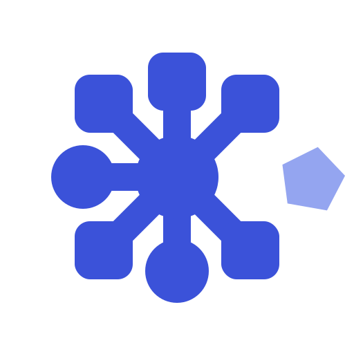
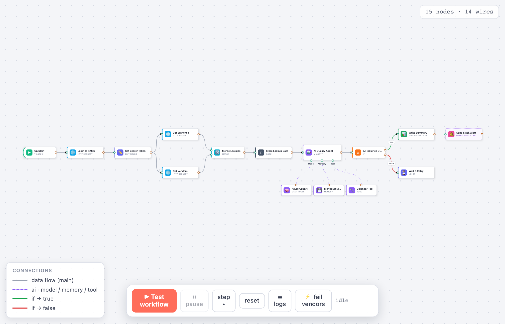

<p align="center">
  <a href="https://grafloria.com"></a>
</p>

<h1 align="center">Grafloria</h1>

<p align="center"><b>The framework-agnostic diagram engine.</b><br>
Flow charts, dashboards, UML, ERD, and real-time collaboration —<br>
one headless core, native in <b>Angular</b>, <b>React</b>, and <b>Vue</b>. MIT, no pro tier.</p>

<p align="center">
  <a href="https://github.com/grafloria/grafloria/actions/workflows/ci.yml"></a>
  <a href="https://www.npmjs.com/org/grafloria"></a>
  <a href="LICENSE"></a>
</p>

<p align="center">
  <a href="https://grafloria.com"><b>grafloria.com</b></a> ·
  <a href="https://grafloria.com/demos/"><b>100+ live demos</b></a> ·
  <a href="https://grafloria.com/compare/"><b>how it compares</b></a> ·
  <a href="https://www.npmjs.com/org/grafloria"><b>packages</b></a>
</p>

---

<a href="https://grafloria.com/demos/interaction/n8n-workflow.html"></a>

<p align="center"><i>An n8n-style workflow editor, a drag-pack <a href="https://grafloria.com/demos/dashboard/dashboard-builder.html">dashboard builder</a>, <a href="https://grafloria.com/demos/diagrams/class-uml.html">UML</a> &amp; ER kits, live-cursor collaboration — every one of them a <a href="https://grafloria.com/demos/">clickable demo</a>, not a mockup.</i></p>

Grafloria is a layered system: a headless model you can run anywhere (including
Node and workers), a renderer that paints it, and thin framework bindings on top. The same
diagram model drives the interactive canvas, the text format, the collab replicas, and the
SVG/PNG/PDF exporters — there is no second implementation to drift.

## Packages

| Package | What it is |
| --- | --- |
| `@grafloria/engine` | Headless core — graph model, commands/undo, layout engines (ELK, dagre, force, tree…), DSL + Mermaid-compatible text format, collab op-log |
| `@grafloria/renderer` | SVG renderer — interaction, theming, a11y outline, and the export pipeline (SVG, PNG, and a self-contained vector **PDF writer**: gradients, soft masks, images, text) |
| `@grafloria/element` | `<grafloria-flow>` custom element + high-level kits: dashboard kit (grid pack, widgets), UML kit, ERD kit — works in any framework or none |
| `@grafloria/react` | React bindings — component custom nodes, hooks, SSR + hydration |
| `@grafloria/renderer-angular` | Angular components, directives, and services |
| `@grafloria/canvas-ng` | Angular canvas integration |
| `@grafloria/vue` | Vue 3 bindings — `v-model` data, slot-based custom nodes |

All packages are on npm under the [`@grafloria`](https://www.npmjs.com/org/grafloria) scope — ESM for bundlers (tree-shakeable) plus CJS for Node.

## Quick start (any page, no framework)

```html
<script type="module" src="shell/grafloria.js"></script>

<grafloria-flow theme="light" fit-view
  nodes='[{"id":"a","position":{"x":0,"y":0},"label":"Extract"},
          {"id":"b","position":{"x":220,"y":0},"label":"Transform"}]'
  edges='[{"source":"a","target":"b"}]'>
</grafloria-flow>

<script>
  document.querySelector('grafloria-flow')
    .addEventListener('grafloria-connect', (e) => console.log(e.detail.link));
</script>
```

Simple data rides on attributes (JSON strings); rich data goes in as properties
(`el.nodes = [...]`) — the standard custom-element contract every framework's template
binding already targets. Custom node templates are `<template data-node-type="…">`
children. Every capability has a working page in the demo gallery.

## The demo gallery is the documentation

**[Play with 100+ live demos → grafloria.com/demos](https://grafloria.com/demos/)** — each
one a real, runnable example of exactly one capability, and each executed in CI as a gate.
If it's in the gallery, it works; if it works, it's in the gallery.

```sh
npm ci
node demos/build.mjs          # bundle libs → demos/shell/grafloria.js
npx serve demos               # any static server — then open /index.html
```

Highlights: dashboard builder with drag-pack grid and version history · live-cursor
collaboration on an op-log with read-only replicas · Mermaid-compatible text round-trip ·
ERD / class-UML kits · async custom nodes captured into exports · PDF export with real
vector gradients, shadows, and images (no rasterized page screenshots).

## Quality gates

The test surface is unusually deep, and all of it runs on every change:

- **6,600+ unit tests** across the engine, renderer, and kits
- **Visual gate** — 220+ golden frames pixel-diffed against blessed captures, with
  per-frame tolerance measured from each demo's own run-to-run jitter
- **Interaction gate** — 1,042 live-gesture checks (real mouse, real browser) across all demos
- **Export gates** — exported SVG/PDF bytes are rasterized and pixel-probed
  (`pdftoppm`), not just string-matched
- **Save/load, dashboard-scenario, and reachability gates** — every public API a demo
  uses must be importable from the published entry points

## Repository layout

Nx monorepo: libraries in [`libs/`](libs/), the demo gallery in [`demos/`](demos/),
an Angular showcase app in [`apps/renderer-demo/`](apps/renderer-demo/), architecture
notes in [`documentation/`](documentation/).

```sh
npx nx run-many -t test       # all unit tests
node demos/e2e/visual-run.mjs # any gate can be run alone
```

## License

[MIT](LICENSE)
