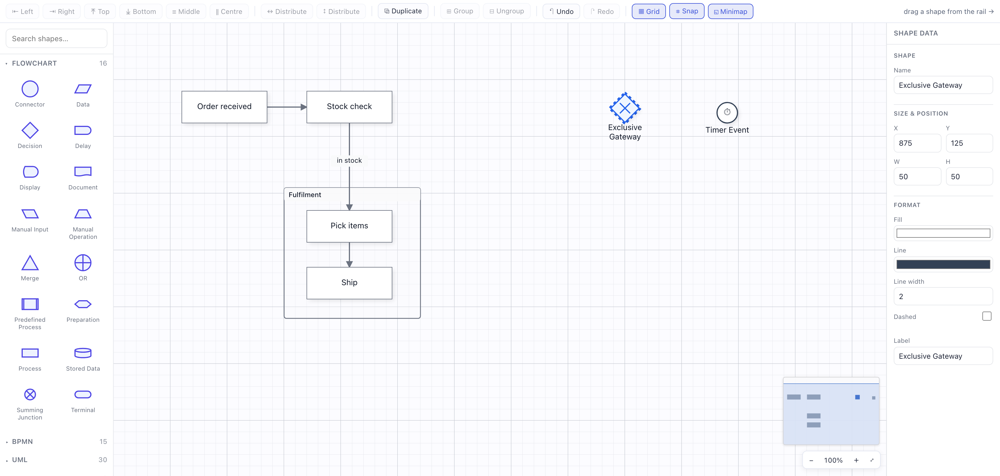

<p align="center">
  <a href="https://grafloria.com"></a>
</p>

<h1 align="center">Grafloria</h1>

<p align="center"><b>Grafloria is an MIT diagram and dashboard engine for JavaScript: one headless core, native Angular, React and Vue bindings, one document format and one undo stack.</b></p>

<table align="center"><tr>
<td valign="top" width="50%">

### Grafloria Diagrams
Grafloria Diagrams is an MIT JavaScript diagram library for flowcharts, workflow editors, UML and ER diagrams, with obstacle-avoiding routing, auto-layout, undo and real-time collaboration built in.

**[grafloria.com/diagrams](https://grafloria.com/diagrams/)** · [React](https://grafloria.com/react/) · [Angular](https://grafloria.com/angular/) · [Vue](https://grafloria.com/vue/) · [JavaScript](https://grafloria.com/javascript/) · [Mermaid](https://grafloria.com/mermaid/)

</td><td valign="top" width="50%">

### Grafloria Dashboards
Grafloria Dashboards is an MIT JavaScript dashboard layout library: draggable, resizable widgets on a grid or a splitter layout, with undo, nesting and persistence built in, for Angular, React, Vue or plain JavaScript.

**[grafloria.com/dashboards](https://grafloria.com/dashboards/)** · [tutorial](https://grafloria.com/learn/javascript-dashboards/) · [live demo](https://grafloria.com/demos/dashboard/fluid-board.html) · `npm i @grafloria/dashboard`

</td></tr></table>

Both share one engine: one document format, one undo stack, a diagram can be a widget in a
dashboard. Every capability is one of 100+ live demos, each executed in CI with real pointer
events. MIT licensed, every feature free; there is no commercial tier.

## Documentation

**[grafloria.com/learn](https://grafloria.com/learn/)** — 10-minute tutorials for
JavaScript, React, Vue and Angular, twelve framework-specific deep guides, twelve
concept guides, and reference pages. Every code sample is executed against the
published packages before it is published. Machine-readable full text:
[llms.txt](https://grafloria.com/llms.txt) / [llms-full.txt](https://grafloria.com/llms-full.txt).

## Packages

| Package | What it is |
| --- | --- |
| `@grafloria/engine` | Headless core — graph model, commands/undo, layout engines (ELK, dagre, force, tree…), Mermaid-compatible text format with type-aware import layout, `.drawio` import, collab op-log |
| `@grafloria/renderer` | SVG renderer — interaction, theming, a11y outline, and the export pipeline (SVG, PNG, and a self-contained vector **PDF writer**: gradients, soft masks, images, text) |
| `@grafloria/element` | `<grafloria-flow>` custom element + high-level kits: dashboard kit (grid pack, widgets), UML kit, ERD kit — works in any framework or none |
| `@grafloria/react` | React bindings — component custom nodes, hooks, SSR + hydration |
| `@grafloria/angular` | Angular components, directives, and services |
| `@grafloria/canvas-ng` | Angular canvas integration |
| `@grafloria/vue` | Vue 3 bindings — `v-model` data, slot-based custom nodes |

All packages are on npm under the [`@grafloria`](https://www.npmjs.com/org/grafloria) scope — ESM for bundlers (tree-shakeable) plus CJS for Node.

## Quick start (any page, no framework)

```html
<script type="module" src="shell/grafloria.js"></script>

<grafloria-flow theme="light" fit-view
  nodes='[{"id":"a","position":{"x":0,"y":0},"label":"Extract"},
          {"id":"b","position":{"x":220,"y":0},"label":"Transform"}]'
  edges='[{"source":"a","target":"b"}]'>
</grafloria-flow>

<script>
  document.querySelector('grafloria-flow')
    .addEventListener('grafloria-connect', (e) => console.log(e.detail.link));
</script>
```

Simple data rides on attributes (JSON strings); rich data goes in as properties
(`el.nodes = [...]`) — the standard custom-element contract every framework's template
binding already targets. Custom node templates are `<template data-node-type="…">`
children. Every capability has a working page in the demo gallery.

## The demo gallery is the documentation

**[Play with 111 live demos → grafloria.com/demos](https://grafloria.com/demos/)** — each
one a real, runnable example of exactly one capability, and each executed in CI as a gate.
If it's in the gallery, it works; if it works, it's in the gallery.

```sh
npm ci
node demos/build.mjs          # bundle libs → demos/shell/grafloria.js
npx serve demos               # any static server — then open /index.html
```

Highlights: a [Visio-style editor](https://grafloria.com/demos/diagrams/visio-editor.html)
with a searchable stencil palette, page grid + snap, zoom/minimap, group/ungroup and a real
properties panel · [.drawio import](https://grafloria.com/demos/misc/drawio-import.html)
(plain **and** compressed saves — the migration on-ramp from diagrams.net) ·
[Mermaid text](https://grafloria.com/mermaid/) in *and* out of the live canvas with
type-aware layout · dashboard builder with drag-pack grid · live-cursor collaboration on an
op-log · ERD / class-UML kits · PDF export with real vector gradients, shadows, and images.

<a href="https://grafloria.com/demos/diagrams/visio-editor.html"></a>

<p align="center"><i>The Visio-style flagship — every gesture in this screenshot is CI-gated: 41 pointer/keyboard cases, an 80-master render sheet, and 13 in-canvas table-editing cases.</i></p>

## Bundle size — read this before judging the npm stats

Installing the package family unpacks ~9 MB — uncompressed ESM source plus
full TypeScript declarations (pure ESM since engine 0.3.0; Node ≥ 20.19 can
`require()` it too). **None of that is shipped weight.** Measured worst-case — importing the *entire* public surface,
esbuild with minify + ESM + `--splitting`:

| entry | eager (gzip) | notes |
|---|---|---|
| `@grafloria/engine` | **228 KB** | headless: model, undo, layout, DSL, validation, collab |
| `@grafloria/react` / `@grafloria/vue` | **334 KB** | + SVG renderer, interaction, export, themes |
| `@grafloria/angular` | **395 KB** | + the full Angular component library |
| `@grafloria/element` | **451 KB** | the whole stack incl. every kit |
| elkjs layout | 432 KB **lazy** | a split chunk that downloads only if ELK layout is invoked |

Real apps importing only what they use ship less. Each package README carries
a two-minute reproduction script; `--splitting` is essential (without it the
lazy ELK chunk gets inlined and inflates the number by ~1.4 MB).

## Quality gates

The test surface is unusually deep, and all of it runs on every change:

- **6,900+ unit tests** across the engine, renderer, and kits
- **Visual gate** — 235 golden frames pixel-diffed against blessed captures, with
  per-frame tolerance measured from each demo's own run-to-run jitter
- **Interaction gate** — 1,119 live-gesture checks (real mouse, real browser) across all 111 demos
- **Editor gates** — 41 pointer/keyboard gesture cases on the Visio-style editor,
  13 in-canvas table-editing cases, and an 80-master render sheet that fails on a
  clipped caption or ink outside a shape's bounds
- **Mermaid oracle** — 28 cases driven through *real* mermaid v11 in both directions:
  everything we read, real Mermaid accepts; everything we write, real Mermaid parses
- **Export gates** — exported SVG/PDF bytes are rasterized and pixel-probed
  (`pdftoppm`), not just string-matched
- **Save/load, dashboard-scenario, and reachability gates** — every public API a demo
  uses must be importable from the published entry points

## Repository layout

Nx monorepo: libraries in [`libs/`](libs/), the demo gallery in [`demos/`](demos/),
**per-framework demo apps** in [`apps/demos-angular/`](apps/demos-angular/),
[`apps/demos-react/`](apps/demos-react/) and [`apps/demos-vue/`](apps/demos-vue/) —
every gallery demo as a real component in that framework, ~100 routes each, live at
[grafloria.com/demos-angular](https://grafloria.com/demos-angular/) (and `-react`, `-vue`) —
plus an Angular showcase app in [`apps/renderer-demo/`](apps/renderer-demo/) and architecture
notes in [`documentation/`](documentation/).

```sh
npx nx run-many -t test       # all unit tests
node demos/e2e/visual-run.mjs # any gate can be run alone
```

## License

[MIT](LICENSE)
